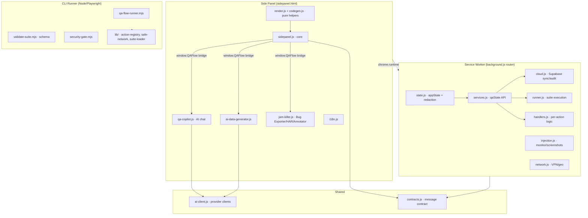

# QA Flow Master Pro 4.3

Chrome recorder plus a production Playwright automation runner. A suite recorded in the extension can be exported, schema-validated, executed against datasets, and used as a CI quality gate.

## Features

- **Recorder & authoring** — record real interactions, auto-generate resilient CSS selectors, or author steps manually (30+ actions)
- **AI Copilot** — generate test scenarios from natural language or screenshots, with multimodal attachments and persistent threads (Gemini / Claude / DeepSeek)
- **AI Sharing Agent** *(toggle in Copilot)* — the AI autonomously drives the open page: finds and clicks the login/register button, reads the form, fills realistic data, follows "next", then hands over a complete test case to save or run
- **AI data generator** — create dataset rows from a prompt
- **Bug Exporter** — one-click export to Slack, Teams, GitHub, Linear, and Jira (JAM-style)
- **Visual & API testing** — screenshot baselines, network/console/security assertions, API requests, mock routes
- **QA Readiness** — requirements, defects, risk coverage, release sign-off, governance audit trail
- **Quality gate CI** — schema validation, secret scanning, unsafe-HTTP and dependency checks, flake scoring
- **Bento UI** — polished dark/light theme, fully responsive, documented in [UI-UX guide](docs/ui-ux-guide.md)

## Architecture

Modular monolith for Chrome MV3: the side panel, background worker, and CSS are split into small single-purpose modules so fixing one system does not ripple into others. A shared `window.QAFlow` bridge exposes block-1 helpers to later modules, and a `qaState` service layer decouples background modules from the raw `appState` shape.



## Repository structure

```
background.js          Service Worker router (importScripts all modules)
background/*.js        state, services, cloud, injection, runner, network, handlers
sidepanel.html         Side panel markup (loads modules in dependency order)
sidepanel.js           Side panel core (UI logic + window.QAFlow bridge)
sidepanel/*.js         qa-copilot, ai-data-generator, jam-killer, agent-protocol, ai-agent, render, codegen
shared/                contracts.js (message/step contract), ai-client.js
css/*.css              Bento design system (11 partials) imported by sidepanel.css
runner/                CLI/CI runner: validate-suite, security-gate, qa-flow-runner, lib/
suites/                Example suite (smoke.json)
tests/unit             Node unit tests (contracts, security, codegen, qaState, ai-client, module-paths)
tests/extension        Chromium e2e tests (boots the real unpacked extension)
tests/qa-flow.spec.mjs Playwright engine implementing every registered action
docs/                  Expert guide + UI-UX guide
```

## Quick start

```bash
npm ci
npx playwright install chromium
npm run check
npm test
npm run qa:validate -- suites/smoke.json
npm run qa:run -- suites/smoke.json
```

Artifacts are written to `artifacts/`:

- `html-report/index.html`
- `junit.xml`
- `results.json`
- failure screenshots, video, and Playwright traces

## Extension

1. Open `chrome://extensions` and enable Developer mode.
2. Choose **Load unpacked** and select this directory.
3. Record or author steps, configure environment/data, and export JSON.
4. Validate and execute that JSON with the commands above.

## CI controls

| Variable | Purpose | Default |
|---|---|---|
| `QA_BASE_URL` | Overrides suite base URL | suite environment |
| `QA_BROWSER` | `chromium`, `firefox`, or `webkit` | `chromium` |
| `QA_DEVICE` | Playwright device name | desktop viewport |
| `QA_WORKERS` | Parallel workers | `1` local, `2` CI |
| `QA_RETRIES` | Retry failed tests | `0` local, `2` CI |
| `QA_TAGS` | Comma-separated suite filter | all suites |
| `QA_STORAGE_STATE` | Authentication state JSON path | none |
| `QA_STORAGE_STATES` | JSON role-to-storage-state matrix | none |
| `QA_ALLOW_PRIVATE_NETWORK` | Explicitly allow trusted private API targets in CI | `false` |
| `QA_VAR_*` | Secret/runtime variables | none |
| `QA_UPDATE_SNAPSHOTS` | Approve visual baselines | `false` |
| `QA_VISUAL_THRESHOLD` | Allowed screenshot pixel ratio | `0.01` |

Example secret: `QA_VAR_PASSWORD_SECRET` resolves `{{password_secret}}` without writing the secret into the exported suite.

## Suite capabilities

- Smart locators with up to eight fallbacks
- Assertions for visibility, state, text, value, attribute, CSS, count, URL, console, network, and screenshots
- API requests with status and JSON-path assertions
- Axe accessibility gates and performance budgets
- Network response mocking, latency, and abort scenarios
- Environment variables and full dataset-row parameterization
- `beforeEach` and `afterEach` hooks
- Tags, owner, priority, and start URL metadata
- Multi-browser/device projects
- HTML, JUnit, JSON, screenshot, video, and trace artifacts
- Trend dashboard and optional `QA_WEBHOOK_URL` notification
- Local encrypted reports, hash-chained audit trail, and revision history (no SBOM/provenance attestation pipeline yet - see [Expert guide](docs/expert-guide.md))
- Requirement-to-step traceability, risk coverage, defect lifecycle, exploratory sessions, and audited release sign-off
- Flake scoring plus owner/expiry-enforced quarantine governance
- CI security gate for hardcoded secrets, unsafe HTTP targets, and high-severity dependency vulnerabilities

See [Expert guide](docs/expert-guide.md) for authoring and CI patterns.

Generate reusable login state with `npm run qa:auth`. The required environment variables are documented in the expert guide.

The extension remains local-first and does not require a user account. Governance records are included in suite JSON exports.

Optional Supabase cloud sync and cPanel video upload are configured in Settings; see [Cloud sync (Supabase) and video storage (cPanel)](docs/expert-guide.md#cloud-sync-supabase-and-video-storage-cpanel) for the required one-time Supabase migration and server-side key setup.

## Development & testing

```bash
npm run check          # syntax-check every module
npm test               # unit tests (node --test tests/unit/*.test.mjs)
node --test tests/extension/extension.test.mjs   # e2e: boots the real extension in Chromium
```

Unit tests cover the message/step contract, background redaction, the `qaState` service layer, pure codegen helpers, AI provider clients (with mocked fetch — no API key needed), and module load-order/path resolution.

## Security notes

- **API keys are local-only**: provider keys live in a dedicated `qa_ai_settings` storage key and never enter `appState` (the Supabase sync payload).
- **Cloud redaction**: credentials in Copilot threads, session secrets, and video settings are redacted before any cloud push.
- **Prompt-injection defense**: scraped DOM is wrapped as untrusted context and the model is instructed to ignore page text as instructions.
- **Safe network**: `secureFetch` blocks private-network targets unless explicitly allowed; redirect targets are validated.
- **Hardened step ingestion**: AI-generated steps are validated against a shared action contract on both the side panel and the background worker.
- **Agent safety gate**: the AI Sharing Agent asks for confirmation before clicking destructive elements (delete/remove/logout/keluar/...) so a prompt-injected page cannot make it delete data or sign out.
- **No `eval`/`new Function`** and all user/AI content passes through `escapeHTML`/markdown-escaping before `innerHTML`.

See [Expert guide](docs/expert-guide.md) for authoring, CI patterns, and advanced governance.
